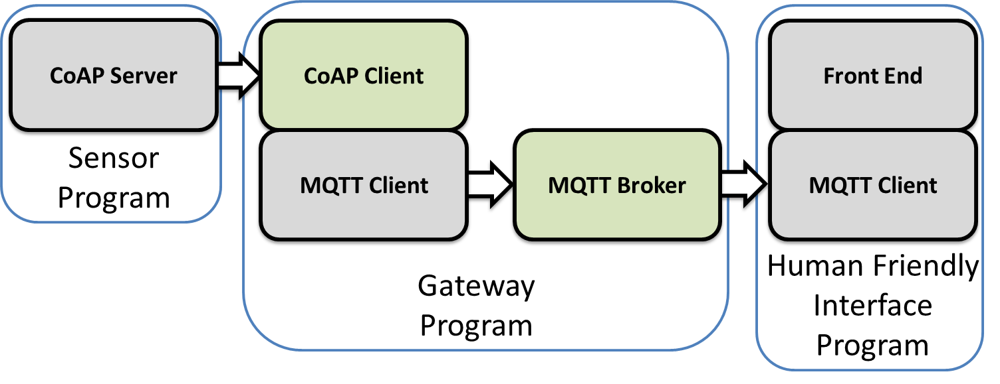

# Smart Home IoT Dashboard

## Overview

This project implements a smart home IoT dashboard that tracks and displays temperature data for various rooms in a student flat. The system leverages CoAP, MQTT, Python, and Java to simulate a multi-component architecture for collecting, processing, and visualizing temperature data.



## Project Structure

```plaintext
Project3/
├── files/
│   ├── Project3_report.pdf
│   └── image.png
├── src/
│   ├── backendSubscriber/
│   │   ├── main.py         # FastAPI backend for frontend
│   │   └──  MQTTClientSubscriber.py  # MQTT Client to recover data from the Broker for the frontend
│   ├── coap/
│   │   ├── DataSender.java # # Utility for sending data to the Gateway
│   │   ├── CoapServer.py   # CoAP server
│   │   └── CoAPClient.java # CoAP client used by the gateway
│   ├── frontend/
│   │   ├── index.html # HTML file of the frontend
│   │   ├── index.js  # JS updating the frontend
│   │   └──  style.css.java # Style of the GUI
│   ├── mqtt/
│   │   ├── BrokerMain.java # Main MQTT broker
│   │   ├── TCPServer.java  # TCP server for handling MQTT connections
│   │   ├── ClientHandler.java # MQTT client handler
│   │   └── MQTTBroker.java # MQTT broker implementation
│   └── gateway/
│       ├── GatewayPublisher.py # Gateway publisher sending data to MQTT broker
│       └── Gateway.java       # Gateway fetching data from CoAP server
├── requirements.txt
└── README.md
```

## Requirements

Ensure the following dependencies are installed :

- Python 3.7+
- Java 17+
- Python packages:
  - `aiocoap`
  - `paho-mqtt`
- Additional tools:
  - `uvicorn`

You can install the Python dependencies with :
```bash
pip install -r requirements.txt
```

## Execution

To compile and launch all the components in the correct order, run in different terminal the following files :

```bash
CoapServer.py
BrokerMain.py
uvicorn main:app --reload (being in the backendSusbcriber folder)
GatewayPublisher.py
Gateway.java
```

### Execution Order:

1. **CoAP Server** (`CoapServer.py`) :
   - Starts a server to simulate room temperature data.
2. **MQTT Broker** (`BrokerMain.java`) :
   - Handles communication between publishers and subscribers.
3. **Backend Subscriber** (`main.py`) :
   - Exposes an API to fetch temperature data for the frontend.
4. **Gateway Publisher** (`GatewayPublisher.py`) :
   - Collects data from CoAP and publishes it to MQTT topics.
5. **Gateway Client** (`Gateway.java`) :
   - Fetches temperature data from the CoAP server.

### Accessing the Dashboard

Once the system is up and running, open your browser and navigate to :
```
the index.html
http://127.0.0.1:8000/api/temperatures
```

## Features

- **Dynamic Subscription**: Users can subscribe or unsubscribe to specific room topics or all topics at once.
- **Real-Time Data Update**: Displays room temperatures and updates every 10 seconds.
- **Performance Metrics**: Tracks and displays system response times.
- **Alerts**: Highlights rooms with high temperatures (>25°C) visually.

## Author
Joël MBIAPA