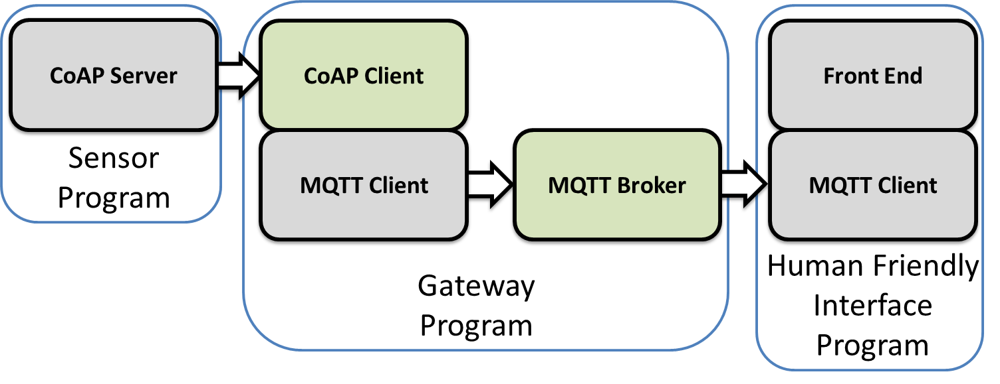

## Programming Project 1: CoAP Client
In the first programming project you will create a client program that can talk to an IoT server (for example a sensor) via CoAP. The program should be able to discover available information on the IoT server, retrieve data from the IoT server, and push data to the IoT server. Hence, you will need to create a program that can correctly connect to a CoAP server, to then send, recive, and interpret CoAP messages.

Remember that you must code everything from scratch. No existing CoAP library is allowed to used. Build it yourself.

Your CoAP client need to minimally support the following commands, and then display the responses from the CoAP server just like a real CoAP client.

- [X] POST
The program should be able to send POST messages to send data to sensors/actuators with a short path names.

- [X] PUT
The program should be able to send PUT messages to send data to sensors/actuators with a short path names.

- [X] GET
The program should be able to send GET messages to retrieve data from sensors/actuators with a short path names. (You don't need to implement block transfer)

- [X] DELETE
The program should be able to send DELETE messages to remove data from sensors/actuators with a short path names.

## Programming Project 2: MQTT Broker
In the second programming project you will create an MQTT broker program that can broker MQTT messages. The program should be able to handle subscribe and unsubscribe requests, as well as handle clients that publish information to the subscribed topics. Hence, you will need to create a program that can correctly recieve connections from MQTT clients and then interpret the basic MQTT messages.

Remember that you must code everything from scratch. No existing MQTT library is allowed to used. Build it yourself.

Your MQTT client need to minimally support the following commands (mqtt version 5.0)

- [X] Connect
The program should be able to receive and handle clients that want to connect

- [X] Subscribe
The program should be able to receive and handle client requests for subscribing to different topics.

- [X] Unsubscribe
The program should be able to receive and handle client request for unsubscribing to previously subscribed topics.

- [ ] Publish
The program should be able to receive and handle clients that want to publish messages to certain topics, including retain functionality.

- [X] MQTT Ping
The program should be able to receive and handle clients that sends MQTT Ping requests

- [ ] Disconnect
The program should be able to receive and handle clients that wants to gracefully disconnect. As well as recover when someone ungracefully disconnects.

## Programming Project 3: Combined IoT Project
In the third and final programming project you will create a combined IoT system, using your code from the two previous projects. You will be provided with a basic structure/skeleton setup, which you then can add more things to yourself. You will have to come up with your own scenario and implementation choices. Below is a figure of the basic skeleton system:

The components in the basic skeleton are: One program running a CoAP server. One program acting as the gateway which is running a CoAP client and an MQTT client. One program running the MQTT broker. And finally, one program running an MQTT client and some form of front-end for your system.

The project is quite open to what scenario you choose, what you choose to extend, etc. But we have some basic requirements:Making it actually correspond to a real scenario (smart home, smart healthcare, industrial control system, etc.)

The project should correspond/emulate/simulate a real IoT scenario (smart home, smart healthcare, industrial control system, etc.)
You must use both of your previous laboration projects. The MQTT broker and the CoAP client.
You must have at least one sensors in your project, easiest is to just emulate/fake it to start with.
You must have some type of human friendly front-end/interface
You must quantitatively measure and evaluate your system. For example by measuring scalability, response times, etc.
You don't need to create the corresponding clients/servers from scratch. You can use ready made libraries for the Coap Server and the MQTT clients, since they should be compatible with your self made code.
It doesn't have to be run on different devices etc. you can run everything on the same machine etc. But it should be possible to move the programs to different devices and they should still work.
Below are some tips on what you can extend the basic skeleton project with:

Run on real IoT devices, like Raspberry Pi
Some form of actuator (alarm, controller, of just a screen)
Adding more sensors and actuators, both CoAP and MQTT connected.
Real-world sensing and actuating using real sensors/actuators
Arduino CoAP sensor server (ex. ESP32, 8266)
REST interface
More advanced measurements and evaluation.
Security aspects (using SSL/TLS, attacking the system, Denial of Service etc.)
Making your system compatible with other IoT platforms such as NodeRed, TheThings.io, Thingsboard, etc. 